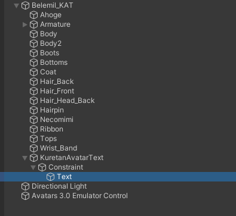
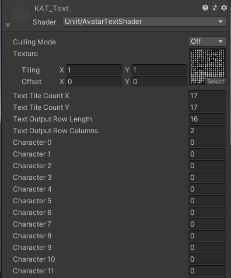
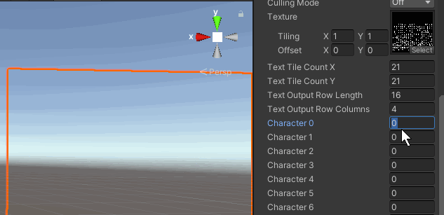
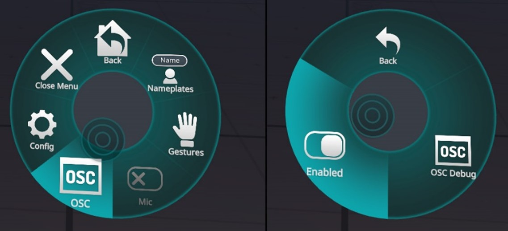

# Kuretan Avatar Text

Kuretan Avatar Text(KAT)はVR Chat上に任意の文章を表示できるUnityPackegeです。KAT SubtitleやKAT Charmapmakerと組み合わせることで、音声認識した文章をお好みのフォントで表示させることができます。

## 導入方法　Unity上での作業

以下の作業を行う前にバックアップの作成を強く推奨します。本ソフトウェアの使用により既存のUnity Packageが破損したとしても私は一切の責任をとりません。またVRC SDK3は最新のものを利用してください。

1.付属のUnityPackgeを開き、KATをimportします。KATの動作にはVRC SDK Avatar 3.0が必要となるので、そちらも忘れずにimportしてください。

2.画面上部のTools->Kuretan Text Avatarを選択すると以下の画面が表示されます。 Optionsが表示されていない場合はOptionsをクリックしてください。

3.Avtarには設定したAvatarを選択してください。

Attachment Pointはテキストをどの部分に配置するかで、headとchestを選択できます。

Sync パラメーターは文字の同期に使用するパラメーター数を指定します。1個から25個まで選択することができます。音声入力を利用される場合は最低でも8個以上を選択してください。推奨は16個以上です。音声入力を利用されない場合は8個以下でも問題ありません。

4.設定が終わったらInstall/Update KATをクリック。正常に終了するとConsoleにKAT install completeと表示されます。

5.文字を表示するオブジェクト（以下テキスト)本体はKuretanAvatarText->Constraint->Textに置かれます。文字の大きさや場所を変更したい場合はこのTextの場所やサイズを変更してください。

このTextオブジェクトには次のようなメッシュレンダーが設定されています。

このShaderの機能はCharmapと呼ばれる何千もの文字が表示された画像を分割することで、任意の一文字を表示することです。

テクスチャの画像を任意のCharmapに変更することで、お好みのフォントや色等に対応することができます。

free版のデフォルトのCharmapは英字・ひらがなのみに対応しています。Charmapを変更することで漢字やハングル・ギリシャ文字などにも対応することができます。漢字対応版に関してはデフォルトの設定で漢字に対応しています。

Charmapの作成にはKAT Charmapmaker（別売り,Boothにて販売中）の利用を推奨します。

Character0は0文字目の文字に対応するパラメーターです。試しにCharacter0を255に設定して見てください。Aという文字が表示されます。256にするとBが表示されるはずです。文字が表示されることが確認できたら設定OKです。後はいつも通りAvatarをアップロードしてください。

## VRchat上での設定

アクションメニューを開き、Setting->OSC->Enabledを選択してください。詳細に関しては公式のドキュメントをご確認ください。

文字をVR Chatに送信するにはKAT Subtitleを利用します。KAT Subtitleの操作方法に関しては、KAT Subtitleに付属している文書をご確認ください。

## Q&A

Q.文字化けする・文字が表示されない

A.Unity上では文字が正常に表示されているのに、VR Chat上では表示されない場合は、KAT本体の問題ではありません。KAT Subtitleの設定を見直してください。

Q.しっかり導入できたかわからない

A.omakeフォルダの中にすでにKATを設定済みのavatarを準備してありますので、そちらを使って動作確認をしてみてください。

Q. Textオブジェクトがデフォルトで非表示になっています

A.OSCの通信が行われたら自動で非表示が解除される設定になっているので問題ありません。

## 開発者向け情報

本ソフトウェアは[KillFrenzyAvatarText](https://github.com/killfrenzy96/KillFrenzyAvatarText)をベースに作成しています。
またomakeフォルダには
[【CC0】シャペルちゃん Avatars3\.0対応VRChat想定](https://booth.pm/ja/items/2290771)およびArktoonシェーダーを利用しています。

## ライセンス

本ソフトウェアは下記に示すものを除きGNU General Public Licenseで配布しています。

・有料版に含まれるCharmap　->再配布禁止

・[【CC0】シャペルちゃん Avatars3\.0対応VRChat想定](https://booth.pm/ja/items/2290771)　-> CC 0

・Arktoonシェーダー　-> MIT ライセンス

## 寄付

KATはKuretan個人により開発されたソフトウェアです。もしKATを気に入っていただけたら、Boothでのブースト購入等で支援がいただけたらありがたいです。
TwitterやVR Chat上での感想やコメント・フィードバックもお待ちしています。
